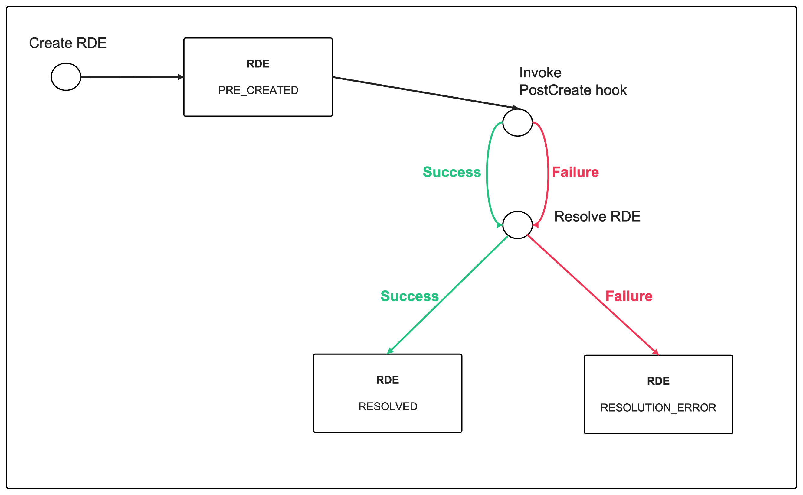
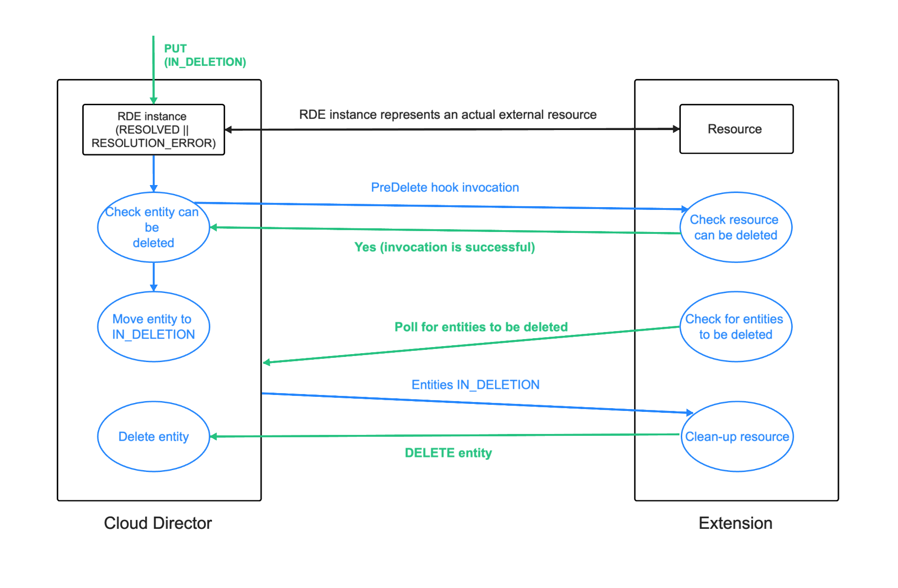
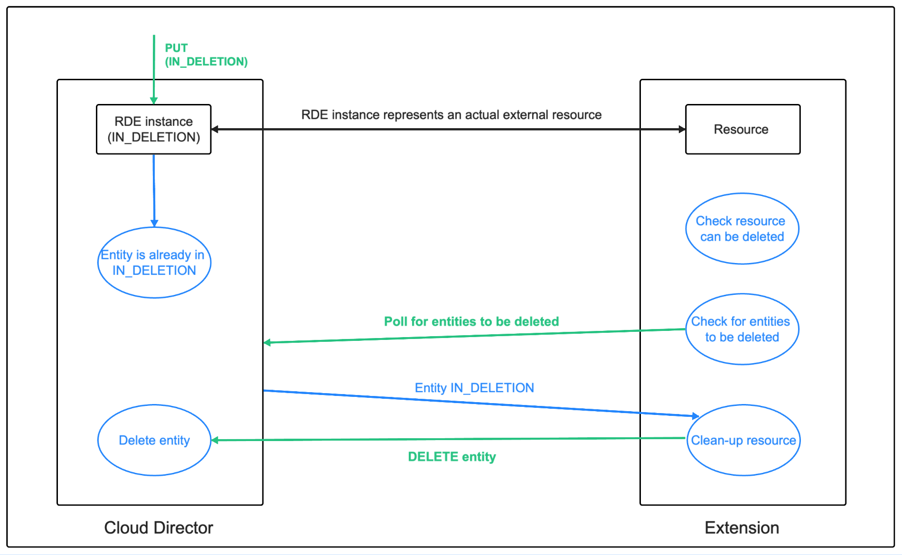
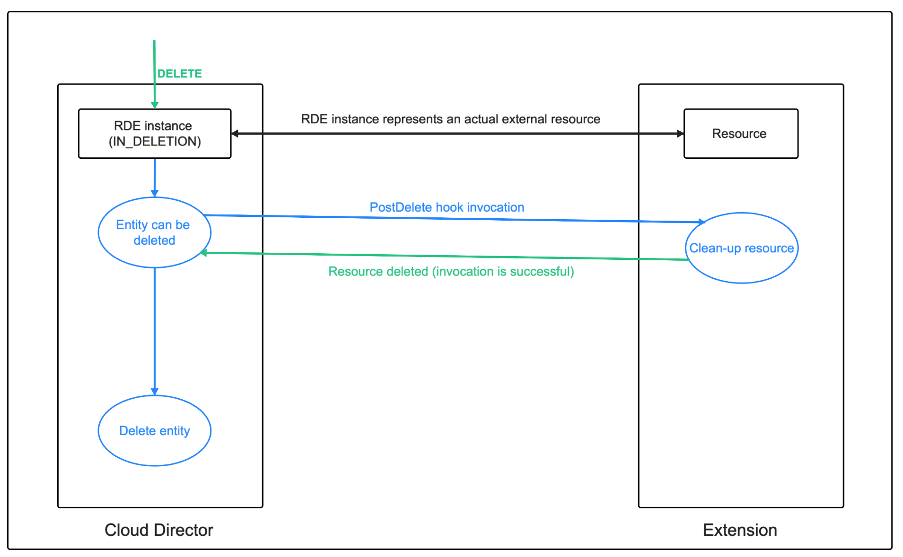
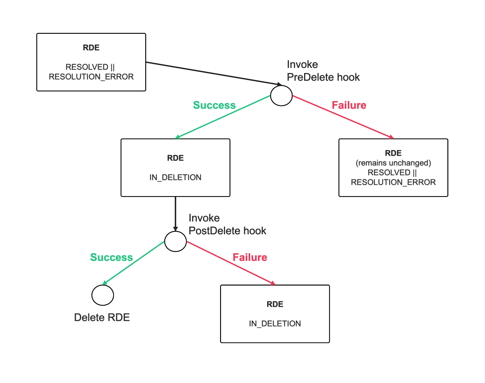

## Runtime Defined Entity Lifecycle Hooks

## Overview

The processing of the events in the [Runtime Defined Entities lifecycle](defined-entities-lifecycle.md#rde-lifecycle)
can be automated by binding [behaviors](behaviors-general-concepts.md) to the lifecycle events.

For example, an extension can define a type that has a property in its schema that describes
the desired state of a system.
Users can create new instances of that type and fill in the property with their desired system state.

The extension can bind behaviors to the `OnCreate` and `OnUpdate` hooks of that type to observe the
modifications in the desired state requested by the users.
The hook behaviors will be invoked upon such modifications and can initiate or perform
processes to satisfy the modified desired state.

## Example

Hooks are configured at the defined entity type level as part of the type definition. The hook behaviors must be defined in one of the interfaces that the defined entity type implements. 

The following REST API call creates an RDE Type that implements the interface `urn:vcloud:interface:clusterVendorA:containerCluster:1.0.0`:

```text
POST
https://{{vcd_host}}:{{vcd_port}}/cloudapi/1.0.0/entityTypes
```

```json
{
    "name": "Basic Container Cluster",
    "vendor": "clusterVendorA",
    "nss": "basicContainerCluster",
    "version": "1.0.0",
    "interfaces": ["urn:vcloud:interface:clusterVendorA:containerCluster:1.0.0"],
    ...
    "hooks": {
        "PostCreate": "urn:vcloud:behavior-interface:autoResolve:clusterVendorA:containerCluster:1.0.0",
        "PostUpdate": "urn:vcloud:behavior-interface:processUpdate:clusterVendorA:containerCluster:1.0.0",
        "PreDelete" : "urn:vcloud:behavior-interface:validateDelete:clusterVendorA:containerCluster:1.0.0",
    }
}
```

The type definition binds three of the interface behaviors to different lifecycle events of the entities of the type:

- the `autoResolve` behavior will be invoked after the initial entity creation
- the `processUpdate` behavior will be invoked every time the entity is modified
- the `validateDelete` behavior will be invoked to check whether the entity can be deleted or not


## Available RDE Lifecycle Hooks

Behaviors can be configured to execute at the different lifecycle stages of a defined entity:
- [Post Create](#post-create-behavior-hook)
- [Post Update](#post-update-behavior-hook)
- [Pre Delete](#pre-delete-hook-behavior)
- [Post Delete](#post-delete-hook-behavior)

Hook behaviors' executions are triggered as part of each API call on the entity leading any of the aforementioned defined entity lifecycle stages (e.g. API call for creating a defined entity). 

A failure in the execution of some of the hooks may cancel the requested entity operation if they fail.

Behavior executions as lifecycle hooks are not subject to any access control rules.

### Post Create Behavior Hook
The post-create hook behavior is invoked automatically on a defined entity instance after its creation. It can be used to create an external resource which the RDE represents, or to make some additional changes to the RDE's entity contents depending on the specific business logic.

To trigger a post-create hook behavior, you need to create an RDE instance via the API:
```
POST /cloudapi/1.0.0/entityTypes/<entity-type-id>
```
Response:
```
202 Accepted

Headers:
...
Location: https://<vcd-host>/api/task/<task-id>
...
```
The RDE create operation is a long-running process in Cloud Director which is traced by a task. If the RDE creation triggers a post-create hook the task returned in the `Location` header of the create RDE API call response is the behavior invocation task.

If the post-create behavior execution completes __successfully__, then the resolve operation is automatically invoked on the defined entity. 

If the execution __fails__, then the entity state is switched to the `RESOLUTION_ERROR` state.



### Post Update Behavior Hook
The post-update hook behavior is invoked automatically after a defined entity instance update. This hook behavior can be used to update the external resource that the RDE represents.

The post-update hook behavior execution does not affect the entity state of the RDE instance in any way.

To trigger a post-update hook behavior, you need to update an RDE instance via the API:
```
PUT /cloudapi/1.0.0/entities/<entity-id>
```
Response:
```
200 OK

Headers:
...
X-VMWARE-VCLOUD-TASK-LOCATION: https://<vcd-host>/api/task/<task-id>
...
```
When a defined entity with a post-update hook is updated, the behavior invocation task is returned in a  `X-VMWARE-VCLOUD-TASK-LOCATION` header in the response of the update RDE API call.

### Pre Delete & Post Delete Behavior Hooks (Multi-stage RDE Deletion)
The pre-delete and post-delete hook behaviors are hooked to the RDE deletion operation. A multi-stage entity deletion process can be achieved using these hooks. 

#### Pre Delete Hook Behavior
The pre-delete hook is intended to be used as a pre-check for whether an entity can be deleted depending on the extension logic. A failure of the pre-delete hook will abort the entity deletion leaving the entity unchanged.

The pre-delete hook behavior is the first operation to be executed when an entity is requested to be marked for deletion or requested to be deleted. 

An entity is requested to be marked for deletion by moving the entity to the `IN_DELETION` state ([more details](#moving-entities-to-in_deletion-state)).

An entity is requested to be deleted by executing a `DELETE` entity API call:
```
DELETE /cloudapi/1.0.0/entities/<entity-id>
```

If the pre-delete hook execution is successful, the requested entity operation is executed (moving entity to `IN_DELETION` or deleting entity). However, if the hook execution fails, then the entity deletion is "canceled" - the entity remains unchanged. 

If an entity is in an `IN_DELETION` entity state before a pre-delete hook execution, the hook is not executed. Cloud Director proceeds as if the pre-delete hook execution is successful (we assume entity can be deleted).

#### Post Delete Hook Behavior
The intended use of the post-delete hook is to do any additional clean-up related to the entity deletion - e.g clean-up any external resources which this entity represents. A failure of the post-delete hook will abort the entity deletion leaving the entity as marked for deletion (in `IN_DELETION` state).

The post-delete hook behavior is invoked immediately before the entity is deleted from the DB (after pre-delete hook execution if there is one). If the hook execution is successful, the entity is permanently deleted. If the hook execution fails, the entity deletion fails and entity remains in `IN_DELETION` state.

#### Multi-stage RDE Deletion 
The multi-stage RDE deletion allows RDE instances to be deleted over several stages and the deletion process can be stopped at any of these stages. This provides an opportunity for the solution backend to release and cleanup the resources that an RDE instance represents before the instance is permanently deleted from Cloud Director. 

The multi-stage deletion can be set-up to be asynchronous or synchronous depending on they way the solution backend will get notified of an entity's deletion starting.

__Asynchronous multi-stage deletion__

In the async scenario, the solution backend is expected to poll the Cloud Director API for entities which are marked for deletion.

To put it simply, the async multi-stage deletion involves the following steps:

1. Marking entities for deletion by moving them to `IN_DELETION` state (more info [here](#moving-entities-to-in_deletion-state)).
2. The solution backend polls for entities in `IN_DELETION` state and starts the deletion process for them (more info [here](#polling-for-entities-to-in_deletion-state)).
3. Once resource clean-up is completed, solution backend can issue a `DELETE` API call for all entities, which are ready to be permanently deleted.





__Synchronous multi-stage deletion__

In the synchronous scenario, the solution backend is expected to configure a post-delete hook on the RDE Type to handle cleaning-up any additional resources.

The following diagrams shows the synchronous multi-stage deletion flow:




The delete operation is kick-started with the `DELETE` RDE API call:

```
DELETE /cloudapi/1.0.0/entities/<entity-id>
```
Response:
```
202 Accepted

Headers:
Location: https://<vcd-host>/api/task/<task-id>
```

The `deleteDefinedEntity` task can be found in the `Location` header of the response of the `DELETE` RDE API call. The operation field of this task holds references to the pre-delete and post-delete hook executions.

```json
{
    ...
    "id": "urn:vcloud:task:bf1ba5ab-9a26-4061-ab5a-1fa7a4583100",
    "operationKey": null,
    "description": null,
    "tasks": null,
    "name": "task",
    "owner": {
        "otherAttributes": {},
        "href": "",
        "id": "urn:vcloud:entity:vmware:testType:0f9bf154-63c3-43f1-a190-aa1173152412",
        "type": "application/json",
        "name": "entity",
        "vCloudExtension": []
    },
    ...
    "result": null,
    "status": "success",
    "operation": "PreDelete hook: urn:vcloud:task:dc3b9f64-93a7-49a5-b3d3-2ea9666cf1f9. PostDelete hook: urn:vcloud:task:7dd7dc68-a84a-4130-a653-285877502ce8.",
    "operationName": "deleteDefinedEntity",
    ...
}
```
The following diagrams show what happens with the RDE's state depending on the success or failure of the hook executions:




If the post-delete hook fails, the entity will remain in `IN_DELETION` state and will not be deleted.

#### Moving Entities to IN_DELETION State

A RDE instance can be moved to `IN_DELETION` state by issuing a `PUT` API call on the defined entity setting the `entityState` field to `IN_DELETION`:

```
PUT /cloudapi/1.0.0/entities/<entity_id>
```

```json
{
    "name": "test",
    "externalId": null,
    "entity": {
        "entity": {
            "VcdVm": {
                "name": false
            }
        }
    },
    "entityState": "IN_DELETION",
    ...
}
```
Response:

```
200 OK
```
If there is a pre-delete hook defined in the RDE type of the entity, the hook will be executed prior to moving the entity into `IN_DELETION` state. If the hook execution succeeds, the entity is moved into `IN_DELETION` state. Otherwise, the entity remains unchanged.

In the case of pre-delete hook existing, the `PUT` call will respond with `202 Accepted` and a task will be returned in the `Location` header of the response:
Response:
```
202 ACCEPTED

Headers:
Location: https://localhost:8443/api/task/06533e8a-e3a0-4502-9cb7-5c758e6da815
```

And the Update RDE task holds a reference to the actual pre-delete hook invocation task:
```json
 {
    ...
    "href": "https://localhost:8443/api/task/06533e8a-e3a0-4502-9cb7-5c758e6da815",
    "type": "application/vnd.vmware.vcloud.task+json",
    "id": "urn:vcloud:task:06533e8a-e3a0-4502-9cb7-5c758e6da815",
    "operationKey": null,
    "description": null,
    "tasks": null,
    "name": "task",
    "owner": {
        "otherAttributes": {},
        "href": "",
        "id": "urn:vcloud:entity:vmware:testType1:39f88374-6e03-4d39-8c81-f9e92a3020cf",
        "type": "application/json",
        "name": "entity",
        "vCloudExtension": []
    },
  ...
    "result": null,
    "status": "success",
    "operation": "PreDelete hook: urn:vcloud:task:7d0f585f-75ea-4af1-a94c-5a0727124d8f.", // pre-delete hook task
    "operationName": "updateDefinedEntity",
    ...
}
```

#### Polling for Entities to IN_DELETION State

To get all entities of a RDE Type in state `IN_DELETION`, you `GET` all entities of the RDE Type filtered by `entityState`:

```
GET /cloudapi/1.0.0/entities/types/vmware/testType1/1.0.0?filter=(entityState==IN_DELETION)
```

## Hook Execution Control

The creators of an RDE Type use the hooks to specify the behaviors that an entity of the RDE Type must follow.
Thus the hook execution cannot be turned off by users of the type.

Users who have Full Control access to the type definition, 
however, can explicitly turn off the hook executions for an operation by providing the `invokeHooks=false` query parameter
in the request. For example:

```text
POST https://{{vcd_host}}:{{vcd_port}}/cloudapi/1.0.0/entityTypes/urn:vcloud:type:clusterVendorA:basicContainerCluster:1.0.0?invokeHooks=false
```

The `invokeHooks` query parameter is accepted only if the user making the request has a Full Control ACL for the specific type. The creator of the RDE type is granted such ACL by default. An ACL can be granted to other users as well via the [Type Access
Controls API](https://developer.broadcom.com/xapis/vmware-cloud-director-openapi/latest/type-access-controls/).
